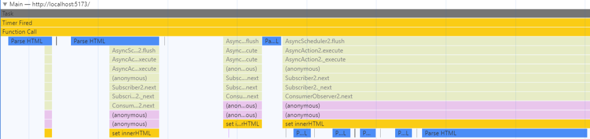

## Overview of the Performance Panel in Chromium-based Browsers

The performance tab gives us the ability to record and capture information about the performance when loading or running a page in the browser. We developers can use this in a variety of ways to diganose performance issues related to our apps, find expensive operations that are slowing our sites down, and get an overall picture of what improvements might benefit our front ends to give users a smoother experience.

At first glance, there seems to be a lot going on within it, but it's not as bad as it looks! 
The entire performance panel is organized into a series of horizontal tracks. 
We can parse through the tracks to focus on specific points of time in a recording.

Here are the different areas of the panel:


### Header Bar


The header bar of the panel contains:
- `Record`, `Start profiling and reload page`, and `Clear` buttons: these control the 
entirety of what we record and analyze within the performance panel.
- In recent versions, we have buttons to load/save profiles into JSON format.
- The `Screenshots` and `Memory` checkboxes, which give us the option 
to include these into the recorded performance profile if we want to analyze them.
- And a broom-icon garbage collection button for cleaning up.


### Timeline Track


The very first track shows an overall graph of the activity during a recording. 
We can use the handles or simply click and drag to select a segment of the timeline 
to analyze it in more detail.

#### Navigating the Timeline
You can use the `W`, `A`, `S`, `D` keys to navigate the performance panel timeline. 
- `W` / `S` :: zoom in and zoom out from the current view of the timeline
- `A` / `D` :: shift the view on the timeline left and right

### Frames Track


Shows frames of the screen when something changes and the browser renders an update. 
You can find where frames drop and look into the surrounding factors to determine 
what is causing the performance to suffer.


### Animations Track


For viewing simple analytics data related to animations performed on the page.


### Main Track



Displays activity that happens on the main thread. This is the central track and will 
likely be the track you spend the most time reviewing for typical use cases.


### Bottom Panel


At the bottom (by default), you will see a few tabs that give you in-depth detail 
on whichever part of the recording you are currently analyzing.


## An Example with RxJS

If you are interested in trying this out yourself, I have published an [example project on GitHub](https://github.com/tanomi-tech/Performance-Profling-Example-with-RxJS-Counters) 
using Vite and RxJS.


Here we use RxJS observables to test multiple elements being updated by the browser every 1 millisecond.

Here is the click event handler that is set up to strigger a rapid update of counter values for all 12 counter elements (marked with class `"counter"`)


```javascript
import { Subject, interval, takeUntil } from 'rxjs';

export const setUpPerfTest = (elm, counters) => {
  elm.innerHTML = 'Start';

  // 'Start' handler
  elm.addEventListener('click', () => {
    elm.innerHTML = 'Stop';
    const stop$ = new Subject();

    // Update all counters every 1 time unit (usually milliseconds)
    interval(1)
      .pipe(takeUntil(stop$))
      .subscribe(
        val => counters.forEach(
          ctr => ctr.innerHTML = val
        )
      );

    // 'Stop' handler
    elm.addEventListener('click', () => {
      stop$.next();

      // Reset 'Start' handler
      setUpPerfTest(elm, counters);

    }, { once: true });
  }, { once: true });
}
```
### Recording a Profile

To record a profile, click record, activate page code to make the browser perform computations, and then stop the recording.





### Analyzing a DOM Event



Here we zoom into where activity picks up on the main thread and we locate the click handler function, 
which is defined anonymously in our `main.js` code above. We are able to see it under the label "(anonymous)".


## Footnotes
- [1] Note: not true milliseconds, it is dependent on the [scheduler](https://en.wikipedia.org/wiki/Scheduling_(computing)).