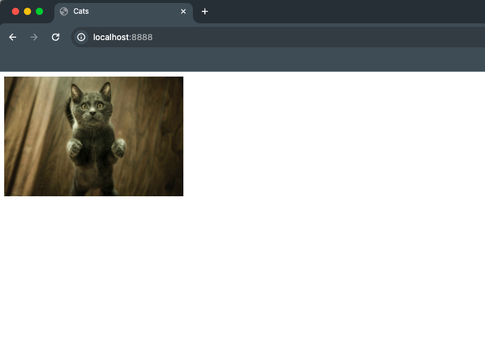
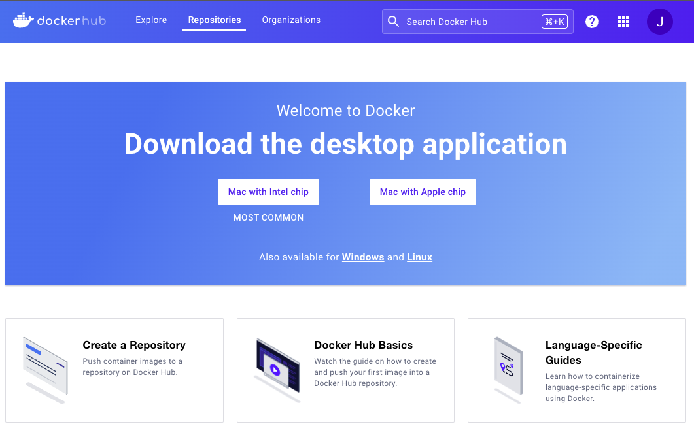

## Overview

This guide will give you a step-by-step on how to deploy a python web application using Docker to a Virtual Private Server (VPS).

This guide will focus on guiding you through setting up a `Dockerfile`, building an image, running it locally, publishing it on Docker Hub, and deploying it to your VPS. DNS Configuration will not covered in this guide.

I created an example Python web application that randomly displays a cat image to demonstrate the deployment process. [https://github.com/tanomi-tech/python-webapp-example](https://github.com/tanomi-tech/python-webapp-example)

## What is Docker?

Docker is a containerization platform that lets you bundle all of your applications dependencies with the goal to make distribution easy across different environments. 

Here are a few reasons why it's great:

1. Isolated - containers run your application in an isolated environment which mitigates interference with the host
2. Shipping Made Easy - in the cloud, on not, containers are able to run anywhere
2. Consistency - No more "...but it works on my machine" drama. Your code behaves the same way wherever it goes
3. Decrease onboarding time - do you have a new hire introduced to the team? no problem. They can run a docker image, spin up a container, and they're ready to go.

## Getting Started

Before we get started, make sure to have the following:
1. Docker installed on your machine(s)
2. Clone the example project from our repository: [https://github.com/tanomi-tech/python-webapp-example](https://github.com/tanomi-tech/python-webapp-example)

Here's a brief breakdown of the application: 

It uses the FastAPI web framework coupled with uvicorn for the server, and Jinja2 for templating. Given the simplicity of the app, we're only handling requests from the `/` path in the `main` method. In `main`, we read all files in the `image` directory and select a random file from the sequence using `random.choice`. Lastly, we pass in our randomly selected cat to our `index.html` template and serve it back to the client. That's all there is to it!

The following contents are included in the example project:

- `main.py`: the server application code that's responsible for serving the static contents
- `static/`: A directory for static assets including the `index.html` and all the wonderful cat images in the sub-directory `images/`.
- `Dockerfile`: the docker file to build the docker image to create and run a docker container. We'll be convering this more in-depth in the next section

## The Dockerfile

The `Dockerfile` is what we use to build the images needed to create and run containers. Here's what the one in our example project looks like: 


```python
FROM python:3

WORKDIR /user/src/app

COPY . .
RUN pip install --no-cache-dir -r requirements.txt

EXPOSE 5000
CMD ["uvicorn", "main:app", "--host", "0.0.0.0", "--port", "5000"]
```

Let's go through it line by line, starting with `FROM`.

**1.** The first line contains the keyword `FROM` specifying the base image - the image you build on top of. 

```python
FROM python:3
```

In our case, we're using Docker's official Python image for the following reasons:

- We avoid having to add an extra couple of lines to our `Dockerfile` to install Python if we were to use an image with an OS like `alpine`
- We get to use the latest up-to-date bugfix releases of Python out of the box

**2.** The next keyword we're going to take a look at is `WORKDIR` - this is where we specify the directory that all subsequent `Dockerfile` instructions will be relative to. For us, we will be applying all further instructions relative to `/user/src/app`.

```python
WORKDIR /user/src/app
```
**3.** `COPY` will, as the keyword hints, copies the files from a source (relative to the location of the `Dockerfile`) to a destination path into our image's filesystem. In our example, we're copying all of the contents in our project relative to our pre-defined `WORKDIR`, which is `/user/src/app`. 

As you may have noticed, this means that `Dockerfile` will also be included which isn't ideal since it's redundant. Alternatively, we can explicitly specify the files and/or directories individually.

```Python
# Approach 1
COPY . .

# Approach 2
COPY static .
COPY main.py .
COPY requirements.txt .
```

**4.** After we copy all of our application files, we can go ahead and install all of our application dependencies that are listed in our `reuirements.txt` by using the `RUN` command to run the following:

```python
RUN pip install --no-cache-dir -r requirements.txt
```

**5.** `EXPOSE` will inform users of what ports will be listening on once the containers are actively running. Since our application will be using port `5000`, we add the following instruction: 

```Python
EXPOSE 5000
```

**6.** Lastly, we will specify the command that will be executed by default once the container is running by using the `CMD` instruction.

```Python
CMD ["uvicorn", "main:app", "--host", "0.0.0.0", "--port", "5000"]
```
There are various ways of specifying the default command, but I've went ahead and used the [exec](https://docs.docker.com/reference/dockerfile/#cmd) form to breakdown the command itself.

`uvicorn` is the base command to run the python server.

`main:app` refers to our `main.py` application that'll be running.

`--host` and `--port` bind the application to run on the blanket IP `0.0.0.0` and on port `5000`. 

The reason we use `0.0.0.0` is because the server will listen for incoming connections on **all** IPs assigned to that machine (in our case, a docker container). If we don't specify the host, then uvicorn will default to `127.0.0.1` which refers to the machine itself.


## Building the Image

Now that we have our `Dockerfile` ready to go, we can now build our docker image!

```bash
docker build . -t py-webapp-image
```

The command takes an optional tag `-t` flag to specify a tag name for the image. Because we're basing our image off of Docker's official Python image, it will automatically detect and build the image based on your OS and architecture because it's image is [multiplatform](https://docs.docker.com/build/building/multi-platform/#building-multi-platform-images).

If you'd like to manually specify the platform, pass in the `--platform` flag with a platform the image supports.

If Docker can't find the base image locally, it'll go ahead and pull the image from Docker Hub first and then create the image. Once it successfully built, you can confirm the image is available by running the following:

```bash
docker images
```

You should get something like this in your output:

```bash
docker images
REPOSITORY          TAG           IMAGE ID       CREATED         SIZE
py-webapp-image     latest        dcbe989a80c5   28 hours ago    226MB
```

## Running the Image

Let's test our application directly on our local machine by running the image using the following command:

```bash
docker run -p 8888:5000 --name cat-app -d py-webapp
```

The `-p` flag allows us to map the exposed port `5000` to our host's port `8888`. Alternatively, we can use `-P` to publish all the exposed ports to random ports on our host machine. You can view all mapped ports using the following command:

```bash
docker port cat-app
```

The `-d` flag allows us to run in detached mode which runs the server in the background and doesn't occupy our terminal with logs.

To confirm, you can run the `docker ps` command to view all actively running containers. Here's what your output may look like:

```bash
docker ps
CONTAINER ID   IMAGE              COMMAND                  CREATED         STATUS         PORTS                    NAMES
a952a4c33f9e   py-webapp-image    "uvicorn main:app --…"   2 hours ago     Up 6 minutes   0.0.0.0:8888->5000/tcp   cat-app

```

Once you run the command above and have the container running sucessfully, you can open `http://localhost:8888` to view the application:



Since containers run independently and in isolation from one another, we can run multiple instances of our application by spinning up new containers based on the same image. This is really cool because you can run the application each with it's own configuration.

## Publishing to Docker Hub

We're more than halfway there! Now it's time to publish the image to Docker Hub, Docker's online registry for image distribution.

If you haven't already, go ahead and sign-up for an account at [https://hub.docker.com/](https://hub.docker.com/)

In the welcome dashboard, navigate to **Create a Repository**. This will redirect you to a Create repository screen that will let you add your repository name under a namespace (defaults to your username).



Once you create your repository on Docker Hub, take note of your repository's name (we will be using it later), and switch back to your terminal.

Now let's login to DockerHub using the following command:

```bash
docker login --username=<USERNAME>
```

This will prompt you to add your password that you use to login to your Docker Hub account. Once you've done so, you should get the following message:

```bash
docker login --username=<USERNAME>
Password:
Login Succeeded
```

Now let's go ahead and push our image up to our repository! Run the following command to publish our `py-webapp-image`:

```bash
docker push py-webapp-image
```

Uh-oh...something seems to be wrong:

```bash
docker push py-webapp-image
Using default tag: latest
The push refers to repository [docker.io/library/py-webapp-image]
f1798efce714: Preparing
06b1d7eceb46: Preparing
a702def9d27d: Preparing
508dfc87ccb1: Preparing
4078a022c6e3: Preparing
f5403ef07884: Waiting
4c9c2b9681ab: Waiting
d4fc045c9e3a: Waiting
denied: requested access to the resource is denied
```
This can happen for a variety of reasons, but for our case, it's due to improperly formatted image names that are required when publishing to Docker Hub. Docker by default uses the `library` namespace but we don't have access to it so we need to explicitly define our namespace which is typically our account username or organization name. [https://docs.docker.com/reference/cli/docker/image/tag/](https://docs.docker.com/reference/cli/docker/image/tag/)

In order to fix it, our docker image will have to meet the following convention: `<USERNAME>/<REPOSITORY_NAME>`

We can do this by using the `docker tag` command to apply a new alias for the existing image. The new alias will be **based on the repository name you recently created in your account**:

```bash
docker tag py-webapp-image <USERNAME>/<REPOSITORY_NAME>
```

Now if you run `docker images`, you will see two images that refer to the exact same Image ID:

```bash
docker images
REPOSITORY                             TAG             IMAGE ID       CREATED         SIZE
<USERNAME>/<REPOSITORY_NAME>           latest          dcbe989a80c5   29 hours ago    226MB
py-webapp-image                        latest          dcbe989a80c5   29 hours ago    226MB
```
Now let's try that again...let's publish!

```bash
docker push <USERNAME>/<REPOSITORY_NAME>
```

Success! Your remote repository should have the latest image on your account.

## Deploying the Image

First thing's first, SSH into your VPS and confirm you have Docker installed. Once you do, deploying the docker image we just worked on is as smooth as butter:

```bash
docker run -p 8888:5000 --name cat-app -d <USERNAME>/<REPOSITORY_NAME>
```

Alternatively, you can use a previously created Docker Image from our repository to run the random cata generator application, as well:

```bash
docker run -p 8888:5000 --name cat-app -d tanomitech/py-webapp-example
```

As we previously discussed, the `docker run` above will pull the image from Docker Hub if it's not available locally, and map port `8888` to the server running on `5000` in the container.

Visit your site's public IP on port `8888` and voila! Our random cat generator is available to the world.

And there you have it! We just deployed our Python web application using Docker! 🎉 🎉 Pretty easy right? There was no need to install the project's dependencies (FastAPI, Uvicorn, Jinja2), and we deployed our application with just one Docker command.

To summarize, here's what we accomplished:

- Setup our `Dockerfile`
- Built and ran our Image locally
- Published our Image to Docker's online registry, Docker Hub
- Deployed to our VPS of choice with just one Docker command

I hope this guide helped deconstruct the general workflow when using Docker to deploy a Python web application. Please don't hesitate to reach out if you have any questions or think I can elaborate or clarify anything in this article!

P.S.

While we're talking about cats, please don't forget to consider adopting a pet or donating to local shelters near you. There are so many animals out there that could use your help. 

Please contact your local shelters for more information on all the animals that would greatly benefit from your contributions, but even more importantly, find their forever home.


